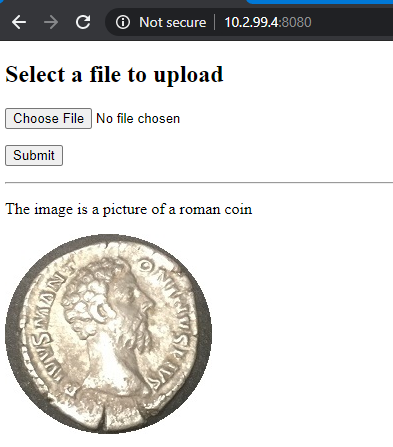

# Overview 

A repo for me to learn AI/ML using the fastai toolkit. 

# Prerequisite
* Azure Bing Search 
    * ```az cognitiveservices account create --kind Bing.Search.v7 -l global --name bjdsearch02 -g ML_RG --sku S1```
    * ```key=$(az cognitiveservices account keys list  -n bjdsearch02 -g ML_RG--query 'key1' -o tsv)```

# Create Model
1. cd src/coin_detector/training
2. pip3 install -r ./requirements.txt
3. python3 ./training_coin_model.py --key ${key}

# Run Web Application 
1. cd src/coin_detector/api
2. pip3 install -r ./requirements.txt
3. python3 ./app.py

# Test
1. Launch Browser 
2. Hit http://<machine-ip>:8080
3. Upload image from tests/ or upload your own image

# Example
